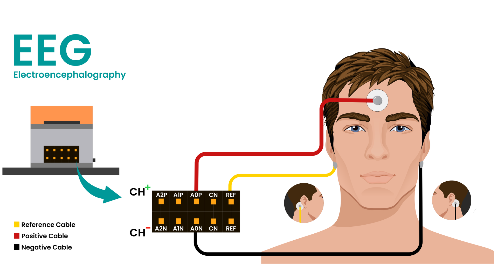

# BCI IR Remote

A brain-computer interface (BCI) remote control. Using Neuro PlayGround Lite, turn your brain, eye and muscle signals into IR remote commands, so you can
record any remote's signals and fire them hands-free, with no mouse or physical
button. Organize commands into up to 5 remotes of 10 each.

A browser app over Bluetooth handles setup, can be used as a manual alternative when you would rather click than gesture.
 
## Hardware

| Part | Link |
| --- | --- |
| Adafruit IR Transceiver | [adafruit.com/product/5990](https://www.adafruit.com/product/5990) |
| 4-pin JST PH to JST SH cable, STEMMA to QT / Qwiic, 200mm | [adafruit.com/product/4424](https://www.adafruit.com/product/4424) |
| NPG Lite kit | [upsidedownlabs.in](https://www.upsidedownlabs.in/shop?search=neuro+playground) |
| 3 x BioAmp Snap Cables | |
| 3 x Gel electrodes | |
| 1 x Alcohol swab | |

### Wiring

| Adafruit IR Transceiver | Pin | Pin on NPG Lite |
| --- | --- | --- |
| Out | SDA | 23 |
| In | SCL | 22 |
| Gnd | Gnd | Gnd |
| Vin | 3v3 | 3v3 |

SDA and SCL are just the wire names on the STEMMA cable. They carry the transceiver's
Out and In signals, and the firmware drives them as ordinary GPIO rather than as an
I2C bus.

### Status LEDs

The onboard NeoPixel ring reports two things at a glance.

| Pixel | Reports | Colours |
| --- | --- | --- |
| 0 | Bluetooth | red not connected, green connected |
| 5 | Battery | red at or below 20%, amber at or below 70%, green above |

### Checking the transceiver is connected

| Indicator | Meaning |
| --- | --- |
| Green power LED | The module has 3V3 and ground. If this is dark, check the cable. |
| OUT and IN LEDs | Each flashes once as a signal passes through it. |

Fire a saved command with a short press of the user button. Both the OUT and IN
LEDs should blink once. Green power LED but no blink means the module is powered
yet its signal pins are not reaching the board, so check pins 22 and 23.

### The user button

The sketch reads GPIO 9, which is the boot button on the NPG Lite and on most
ESP32-C6 boards. On a different dev board this pin will be wrong, change
`USER_BTN_PIN` at the top of the sketch to whichever button that board exposes.

## Flashing

First, Flip the power switch on the NPG Lite and make sure its battery cable is connected.
Then, Connect it to your computer with a USB to Type-C cable.

Two ways to flash: The web flasher is quicker if you only want to run the firmware. Use the
Arduino IDE if you plan to change it.

### Web flasher

Use the [NPG Lite Flasher Web](https://upsidedownlabs.github.io/NPG-Lite-Flasher-Web/).

1. Press **Connect** and pick the **USB JTAG** serial device.
2. Press **Get from GitHub** and choose the **BCI-IR-Remote** firmware.
3. Flash it. You can unplug the cable once it finishes.

### Arduino IDE

1. Download and install the [Arduino IDE](https://www.arduino.cc/en/software).
2. Install these from the Library Manager, under **Tools -> Manage Libraries**.
   - `IRremoteESP8266` (tested against 2.9.0)
   - `Adafruit NeoPixel`
3. Install **ESP32 (version 3.2.0)** by Espressif Systems from the Boards Manager.
   Go to **Tools -> Board -> Boards Manager**.
4. Download the [NPG-Lite-Arduino-Firmware](https://github.com/upsidedownlabs/NPG-Lite-Arduino-Firmware)
   repository.
5. Open `BCI-IR-Remote.ino` from its `BCI-IR-Remote` folder.
6. Open the board selector dropdown at the top of the window, the one that reads
   **Select Board**, and pick your board's COM port. It may show as an ESP32 Family
   Device.
7. Go to **Tools -> Board -> ESP32 -> ESP32C6 Dev Module**.
8. (Optional) Go to **Tools -> Partition Scheme -> Huge APP (3MB No OTA/1MB SPIFFS)**.
9. Hit the upload button.

The sketch fits on the default partition scheme too, but only barely, so step 8 is
optional. It brings the sketch down to about 40% and leaves room to spare if you
plan to add more to it.

## Setup and manual control (browser app)

Recording remotes and commands always happens here, and it also works as a
manual alternative to BCI control: point, click, and fire from the app instead
of gesturing.

Open
[NPG-Lite-Arduino-Firmware in BioAmp Arduino Firmware Explorer](https://upsidedownlabs.github.io/BioAmp-Arduino-Firmware-Explorer/?owner=upsidedownlabs&repo=npg-lite-firmware)
and go to **web app** under **BCI-IR-Remote**.

Alternatively, download this repo and open `index.html` in your browser.

Either way you need a Chromium based browser like Chrome, Brave or Edge, or any
browser with Web Bluetooth. Firefox and Safari do not support it.

1. Press **Connect** and pick **NPG-IR**.
2. Press the lock icon in the header to unlock. Nothing can be added or changed
   while locked.
3. Press **+** on one of the five remote slots on the left and name it. That
   creates its ten command slots.
4. Open the remote, press **+** on a command slot, then point a real remote at
   the board and press a key.
5. Name the capture and save it.
6. Lock again when you are done setting up.

Once unlocked, every remote and command can also be renamed or deleted from the
same row. Press the send button on a command to fire it, or use the board's own
user button to fire whichever command is currently highlighted. A short press
fires it, and holding it for 1.5 seconds starts recording into the open remote.

The info button in the header covers the same ground inside the app.

## Brain-computer interface (BCI) control

This is the point of the project: controlling the remote hands-free, with
muscle and brain signals read by BioAmp electrodes, instead of the browser app.

The four navigation controls, **Forward**, **Backward**, **Shoot IR** and
**Switch Remote**, can each be driven by a muscle or brain gesture instead of a
mouse or the board's button. Forward and Backward move the highlight through the
open remote's commands. Switch Remote steps to the next remote and selects its
first command. Shoot IR fires whichever command is currently selected.

Open **Controls** in the app header and set, for each of the four, which channel it
watches, what that channel is filtered for, and which gesture triggers it. The bar
next to each one shows its live signal, and the slider under it sets the threshold,
just above your resting level and below a deliberate gesture.

Set `BIOAMP_ENABLED` to `false` at the top of the sketch for a plain IR remote with
no bio-potential sampling at all. Leave it on only with electrodes attached, since a
floating input drifts and will trigger on its own.

### Skin preparation and electrode placement

1. Clean your skin with an alcohol swab, on your forehead and behind both ears.
2. Snap the BioAmp Snap cables onto the gel electrodes, then peel off the plastic
   backing and place them: one on your forehead, which is positive, and one behind
   each ear on the bony part, which are negative and reference.
3. Connect the other end of each wire to the NPG Lite:
   - Positive to **A0P**
   - Negative to **A0N**
   - Reference to **REF**

What a channel can trigger depends entirely on what it is filtered for, which in
turn depends on where the electrodes sit:

| Filter | Placement | Available triggers |
| --- | --- | --- |
| EEG | single channel, one pair of electrodes | jaw clench, focus, and blink |
| EMG | on a muscle | clench (tap or held) only |
| EOG | around the eye | blink only |

For placement diagrams and more detail, see Upside Down Labs' guides:

- [Skin preparation](https://docs.upsidedownlabs.tech/guides/usage-guides/skin-preparation/index.html)
- [Using gel electrodes](https://docs.upsidedownlabs.tech/guides/usage-guides/using-gel-electrodes/index.html)

## Storage

Remotes, commands and captured waveforms all live on the board, split across NVS
(names) and LittleFS (waveforms), and survive a firmware upload. Use **Erase all**
in the app's info panel to clear everything.

Upgrading to a firmware build with a different storage layout wipes what was saved
once, automatically, on first boot after the flash. That is expected, not a bug.

---

Making neuroscience affordable and accessible for everyone

[Upside Down Labs](https://upsidedownlabs.in)
