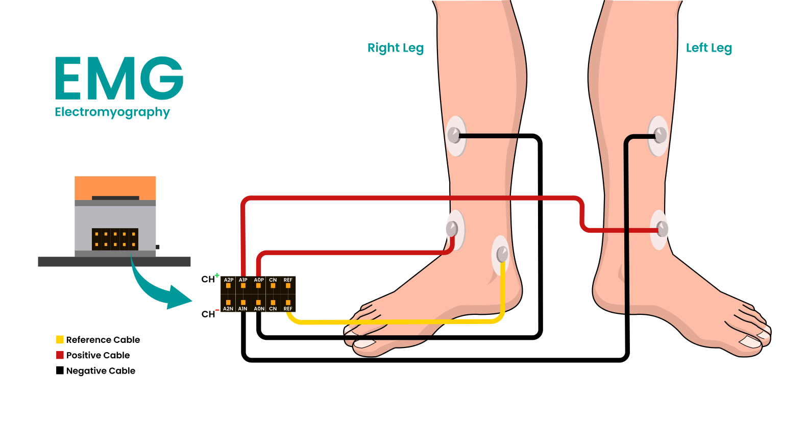
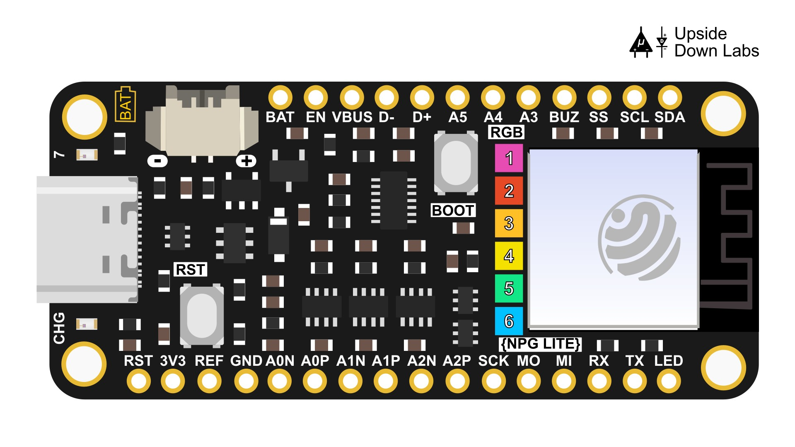

# Gaming Wheel

NPG Lite brings you a custom built racing setup with real driving experience. Steer with a 3D printed steering wheel and press the imaginary pedals with your legs using **muscle signals (EMG)** to play racing games. NPG Lite shows up as an Xbox controller eleminating the need of any other propritory software to emulate a controller.

## What You Need

- Neuro Playground Lite (Ninja or Beast)
- MPU6050 module with a Qwiic port and a Qwiic cable. If you can't find an MPU6050 module with Qwiic port, you can solder the Qwiic cable directly to the module or use jumper wires to connect a module with header pins
- A 3D printed steering wheel to hold the NPG Lite (The 3d file to print is available [here](assets/3D-Steering-wheel.stl))
- A tripod or similar tool with ball joint to hold the Wheel while providing the ability to move like a steering wheel. We used a tripod, check pictures to know more about this
- Alcohol swabs (to clean the surface of your skin)
- 5 pcs gel electrodes and 5 snap cables for two EMG channels
- A computer with Bluetooth and any controller supported racing game
- [Arduino IDE](https://www.arduino.cc/en/software/)

## Arduino Libraries

Install these from the Library Manager:

- NimBLE-Arduino (by h2zero)
- Callback (by Tom Stewart)
- Adafruit MPU6050 (by Adafruit)
- Adafruit NeoPixel (by Adafruit)

ESP32-BLE-CompositeHID is not in the Library Manager. Download the ZIP from
https://github.com/upsidedownlabs/ESP32-BLE-CompositeHID and add it with Sketch > Include Library > Add .ZIP Library.

> **Important**: If you already have the ESP32 BLE Combo library or any ESP32-BLE-Keyboard/Mouse installed, remove it. Both libraries contain a file called `BleConnectionStatus`, and the build will fail with a "multiple definition" error.

## Connect NPG Lite to the Computer

1. Turn on NPG Lite by flipping the ON/OFF switch. If it's not turning ON, make sure the battery cable is connected.
2. Connect NPG Lite to your Computer using a USB Type-C cable.

## Uploading the Firmware

1. Once you've downloaded the Arduino IDE, install the libraries mentioned above.
2. Install ESP32(version 3.2.0) by Espressif Systems from boards manager. (**Tools -> Board -> Boards Manager**)
3. Go to [NPG-Lite-Arduino-Firmware](https://github.com/upsidedownlabs/NPG-Lite-Arduino-Firmware) and copy the Firmware code from NPG-Lite-Racing folder.
4. Open a new sketch in your Arduino IDE, delete the existing code and paste this code.
5. Select the correct COM port (might show as ESP32 Family Device) from ports.
6. Go to **Tools -> Board -> ESP32 -> ESP32C6 Dev Module**, and hit the upload button.

## Connections and Electrode Placement

1. Prepare your skin with alcohol swabs at Fibularis brevis muscle of both your legs and one bony part and let the skin dry completely. Refer to the electrode placement diagram above.
2. Snap the BioAmp Cables on the gel electrodes, peel it off the plastic pack and paste it on your skin as per the diagram above.
3. Connect the positive and negative of right leg to A0P and A0N, left leg to A1P and A1N and reference to Ref:
   - **A0** is the accelerator leg.
   - **A1** is the brake leg.
   - For each channel, place the positive and negative electrodes a few centimetres apart over the leg muscle, parallel to the muscle fibres.

Refer to the electrode placement diagram above for the exact positions.
4. Now, connect the MPU 6050 to the Qwiic port of NPG Lite using a Qwiic cable 
   - You might need to solder the wires of the Qwiic cable to MPU6050 if you can't find a module with a Qwiic port.
5. Screw NPG Lite onto the wheel using compatible screws through the holes on the case.
6. Then attach the 3D printed wheel to the tripod.

## Getting Started and Calibration

1. Enable Bluetooth on your windows and NPG-Lite-Racing should pop up, connect to it.
   - If it doesn't show up under new devices, make sure Qwiic cable is properly connected and MPU6050 led is bright red, because Bluetooth will not start until the MPU6050 responds.
2.  Hold the wheel still at the center. After a few seconds of connecting, NPG Lite will vibrate for calibration.
   - **First vibration:** turn the wheel all the way to the left upto the max point you want and hold it there.
   - **Vibration stops:** bring the wheel back to the center.
   - **Second vibration:** turn the wheel all the way to the right upto the max point you want and hold it there.
   - **Vibration stops:** bring the wheel back to the center.
   - **One short vibration:** calibration is done and the wheel is ready.
   - If you want to recalibrate at any point, just reset the device using the reset button, it will connect automatically and recalibrate.

How far you turn during calibration becomes full steering lock, so turn as far as you actually want to turn while playing. To calibrate again, just reset the NPG Lite.

## Controls

- Turn the wheel to steer. The further you turn, the more the car turns.
- Flex the accelerator leg muscle to speed up. A harder flex gives more throttle.
- Flex the brake leg muscle to brake. A harder flex gives more braking.
- Press the boot button on NPG Lite to press the A key in game.
- When the game sends vibration feedback meant for the controller, the device vibrates as well.

## Status LEDs for this project

NPG Lite has six RGB LEDs. This project uses three of them, numbered as in the image below.

- **LED 1 (Bluetooth):** red until connected, green when connected, blue while you are steering or pressing a pedal.
- **LED 4 (MPU6050):** fading red while it waits for the MPU6050 at startup, green once the MPU6050 is working.
- **LED 6 (Battery):** green above 70 percent, orange between 20 and 70 percent, red at 20 percent or below.

>If the MPU6050 is unplugged while playing, bluetooth disconnects and LED 4 goes back to fading red until the MPU6050 is connected again. You have to recalibrate the wheel after every bluetooth connection.

## Adjusting the Settings

All the settings are at the top of `Gaming-Wheel-test.ino`.

- `EMG_ENV_MIN` is the muscle effort where a pedal starts to press. Lower it if the pedals feel too hard.
- `EMG_ENV_MAX` is the effort for a fully pressed pedal. Lower it if you cannot reach full throttle.
- `STEER_DEADZONE_DEG` is the small area near the center that stays at zero. Raise it if the car drifts when you hold the wheel still.
- `STEER_SMOOTHING` makes the steering smoother but a little slower to react.
- `STEER_EXPO` gives finer control near the center. Try 0.3 to 0.5 if the steering feels too sharp.

> **Important**: You need to unpair NPG Lite from the bluetooth settings once you're done playing since other programs which uses Web BLE will cause some connection issues due to the paired device. 